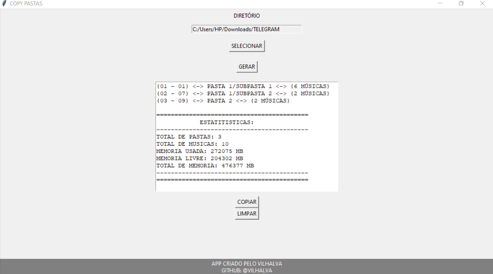

# COPY PASTAS
🎈COPIE O NOME DE TODOS OS DIRETÓRIOS E SUBDIRETÓRIOS.

 <br>

## DESCRIÇÃO:
O aplicativo "COPY PASTAS" é uma ferramenta simples e intuitiva, criada com a biblioteca Tkinter em Python, para listar e gerenciar caminhos de diretórios e subdiretórios, exibindo a quantidade de arquivos `.mp3` em cada pasta. Além disso, o aplicativo oferece estatísticas detalhadas sobre a quantidade de pastas, músicas e o espaço de armazenamento usado, livre e total do diretório selecionado. A principal funcionalidade é listar os caminhos dos diretórios de um caminho raiz selecionado e exibi-los de forma organizada, incluindo o número de músicas em cada diretório, permitindo fácil cópia desses caminhos para a área de transferência.

## FUNCIONALIDADES:
1. **Selecionar Diretório**:
   - **Botão "SELECIONAR"**: Abre uma janela de diálogo para que o usuário selecione o diretório base do qual deseja listar os subdiretórios. O caminho do diretório selecionado é exibido em um campo de entrada de texto.

2. **Gerar Lista de Diretórios com Contagem de Músicas**:
   - **Botão "GERAR"**: Após a seleção do diretório, este botão processa a estrutura de diretórios e subdiretórios a partir do diretório selecionado. O aplicativo lista os diretórios e subdiretórios, informando também a quantidade de arquivos `.mp3` contidos em cada um, além de organizar os diretórios com uma numeração que facilita a navegação por sistemas embarcados de seleção de faixas.
   - **Formato da Listagem**:
     - Cada linha é formatada da seguinte maneira: `{01 - 01} <-> PASTA/SUBPASTA <-> {X MÚSICAS}`, onde a primeira seção indica a numeração do diretório, a segunda é o nome do diretório, e a terceira entre `{}` indica a quantidade de músicas no diretório.
   - **Exemplo**: 
     ```
     {01 - 01} <-> PASTA 1/SUBPASTA 1 <-> {5 MÚSICAS}
     {02 - 06} <-> PASTA 1/SUBPASTA 2 <-> {2 MÚSICAS}
     {03 - 08} <-> PASTA 2/SUBPASTA <-> {5 MÚSICAS}
     {04 - 13} <-> PASTA 3 <-> {2 MÚSICAS}
     ```
   - **Durante a Geração**: O aplicativo desconsidera a pasta `System Volume Information` e ignora acentos nos nomes dos diretórios.

3. **Exibir Estatísticas**:
   - **Memória Total, Usada e Livre**: Após a geração da lista de diretórios e subdiretórios, o aplicativo exibe informações sobre o armazenamento do diretório selecionado (no caso de ser uma unidade removível como um pendrive). As seguintes estatísticas são exibidas:
     - **TOTAL DE PASTAS**: Quantidade de pastas/subpastas encontradas.
     - **TOTAL DE MÚSICAS**: Quantidade total de arquivos `.mp3`.
     - **MEMÓRIA USADA**: Espaço utilizado no dispositivo.
     - **MEMÓRIA LIVRE**: Espaço disponível.
     - **TOTAL DE MEMÓRIA**: Capacidade total do dispositivo.
   - **Formato das Estatísticas**:
     ```
     ============================================
                 ESTATÍSTICAS:
     --------------------------------------------
     TOTAL DE PASTAS: 10
     TOTAL DE MÚSICAS: 171
     MEMÓRIA USADA: 5955 MB
     MEMÓRIA LIVRE: 2108 MB
     TOTAL DE MEMÓRIA: 8064 MB
     ---------------------------------------------
     =============================================
     ```

4. **Copiar para a Área de Transferência**:
   - **Botão "COPIAR"**: Copia a lista formatada de caminhos de diretórios, junto com a quantidade de músicas e estatísticas de armazenamento, para a área de transferência do sistema operacional, permitindo fácil colagem em outros aplicativos.

5. **Limpar Texto**:
   - **Botão "LIMPAR"**: Limpa o conteúdo da área de texto onde os caminhos dos diretórios e as contagens de músicas são exibidos.

## POR QUE CRIEI ESTE APP?
Após usar o [DRIVESORT](https://www.anerty.net/software/file/DriveSort/) para manter a ordem dos diretórios e subdiretórios do meu PC em sistemas embarcados, percebi a necessidade de criar um novo aplicativo que armazenasse e listasse os nomes desses diretórios em ordem.

Eu utilizo meus pendrives em diversos sistemas embarcados, como caixas de som e DVDs, que geralmente não têm tela, apenas saídas de áudio. Isso tornava cansativo ter que adivinhar ou memorizar o número dos diretórios/faixas de cada álbum.

Com este aplicativo, agora posso facilmente localizar o número do álbum que desejo acessar no sistema embarcado, tornando o processo rápido e prático.

## EXECUTANDO O PROJETO:
1. **Inicie o Aplicativo**:
   - Para executar o script Python, navegue até o diretório `./CODIGO`, e execute o comando:
   ```bash
   python CODIGO.py
   ```

2. **Selecione o Diretório**:
   - Clique no botão "SELECIONAR" para abrir uma janela de seleção de diretório. Navegue até o diretório base desejado e selecione-o. O caminho selecionado aparecerá no campo de entrada de texto.

3. **Gerar a Lista de Diretórios com Contagem de Músicas**:
   - Clique no botão **"GERAR"** para processar o diretório selecionado. O aplicativo percorrerá todos os subdiretórios e exibirá uma lista numerada no campo de texto principal. Cada linha representará o caminho completo dos subdiretórios, incluindo a quantidade de arquivos `.mp3` em cada um. 
   - O formato da listagem será `{01 - XX} <-> PASTA/SUBPASTA <-> {X MÚSICAS}` com as estatísticas logo abaixo.
    
4. **Copie a Lista**:
   - Após a geração da lista, clique no botão "COPIAR" para copiar o conteúdo da área de texto para a área de transferência. Isso permitirá que você cole os caminhos em outro aplicativo ou documento.

5. **Limpe o Texto**:
   - Se precisar começar de novo ou simplesmente limpar a área de texto, clique no botão "LIMPAR".

## SOBRE O EXECUTAVEL E O INSTALADOR:
### 1. EXECUTANDO:
   - O instalador está disponível apenas para `Windows X64`. Para instala-lo, basta dar dois cliques e seguir as orientações na tela. 

   - O executável está disponível apenas para `Windows X64` (No diretório `APP`). Para executá-lo, basta dar dois cliques. O executável é bastante útil caso o Python não esteja instalado. Trata-se da mesma aplicação do arquivo `CODIGO.py`. Se desejar, você pode recompilá-lo novamente; é para isso que forneci o arquivo `imagem.ico`.

   - É importante explicar que ao executar o arquivo executável deste programa, é possível que o antivírus dispare um alerta de segurança. Isso ocorre porque o programa executa comandos do sistema operacional e pode abrir outros aplicativos ou acessar a rede.

   **Para lidar com isso, há 2 alternativas:**

   1. **Adicionar exceção ao antivírus:** Você pode optar por adicionar uma exceção ao antivírus para permitir que o programa execute comandos do sistema sem disparar alertas. Isso geralmente pode ser feito acessando as configurações do antivírus e adicionando o arquivo executável do programa à lista de exceções.

   2. **Executar apenas o `CODIGO.py`:** Uma alternativa é optar por executar apenas o arquivo de código-fonte Python (`CODIGO.py`). Isso evita que o antivírus dispare alertas, já que você e o sistema podem inspecionar o código fonte diretamente.

### 2. GERANDO O EXECUTAVEL:
   **1. Instalação do [PyInstaller:](https://pyinstaller.org/en/stable/)**
   - Certifique-se de ter o PyInstaller instalado. Se não tiver, instale usando o comando abaixo:
   ```bash
   pip install pyinstaller
   ```

   **2. Gerando o Executável:**
   - Para gerar o executável, utilize o comando `pyinstaller` seguido de opções:
      - `--icon="imagem.ico"`: Especifica o ícone do executável.
      - `-w`: Especifica que o executável será do tipo "windowed", ou seja, sem exibir uma janela de console.
      - `-F`: Gera um único arquivo executável em vez de vários.
      - `CODIGO.py`: Substitua "CODIGO.py" pelo nome do seu arquivo Python principal.
   ```bash
   pyinstaller --icon="imagem.ico" -w -F CODIGO.py
   ```

### 3. GERANDO O INSTALADOR:
#### PASSO 1: BAIXAR E INSTALAR O INNO SETUP:
1. **Download**: Baixe o Inno Setup do site oficial: [Inno Setup](http://www.jrsoftware.org/isdl.php).
2. **Instalação**: Siga o assistente de instalação para instalar o Inno Setup no seu sistema.

#### PASSO 2: CRIAR O SCRIPT DO INSTALADOR:
1. **Abrir o Inno Setup**: Após a instalação, abra o Inno Setup.
2. **Novo Script**: Na tela inicial, clique em "New Script" e selecione "Next" no assistente que aparecer.
3. **Informações Básicas**:
   - **Application Information**: Preencha as informações da sua aplicação, como nome, versão, nome do publisher e website.
   - **Application Destination Base Folder**: Normalmente, você pode deixar como "{pf}\YourAppName" (para instalar no diretório de Program Files).
   - **Application Directory**: Selecione a pasta onde estão os arquivos da sua aplicação. Em `./CODIGO` desse repositório.
   - **Application Files**: Adicione todos os arquivos necessários para a instalação da sua aplicação (executáveis, DLLs, etc).
   - **Application Shortcuts**: Escolha se deseja criar atalhos no menu Iniciar, na área de trabalho, etc.
   - **Application Documentation**: Adicione arquivos de licença e outros documentos necessários.
4. **Output**: Escolha onde o arquivo de instalação (.exe) será salvo.
5. **Create Script**: Clique em "Finish" para gerar o script base.

#### PASSO 3: EDITAR O SCRIPT:
O Inno Setup irá abrir o script gerado automaticamente. Aqui, você pode fazer ajustes se necessário. O script terá uma estrutura básica como esta:

```pascal
[Setup]
AppName=Your Application Name
AppVersion=1.0
DefaultDirName={pf}\YourAppName
DefaultGroupName=YourAppName
OutputBaseFilename=setup
Compression=lzma
SolidCompression=yes

[Files]
Source: "C:\Path\To\YourApp\*"; DestDir: "{app}"; Flags: ignoreversion

[Icons]
Name: "{group}\YourAppName"; Filename: "{app}\YourApp.exe"
Name: "{commondesktop}\YourAppName"; Filename: "{app}\YourApp.exe"; Tasks: desktopicon

[Run]
Filename: "{app}\YourApp.exe"; Description: "{cm:LaunchProgram,YourAppName}"; Flags: nowait postinstall skipifsilent
```

#### PASSO 4: COMPILAR O SCRIPT:
1. **Compilar**: Com o script aberto no Inno Setup, clique no botão "Compile" na barra de ferramentas.
2. **Verificar**: O Inno Setup irá compilar o script e criar o arquivo de instalação na pasta especificada.
3. **Testar**: Execute o instalador gerado para testar e verificar se tudo está funcionando corretamente.

#### PASSO 5: PERSONALIZAÇÕES ADICIONAIS (OPCIONAL):
Você pode adicionar customizações ao seu instalador, como adicionar telas personalizadas, verificações de pré-requisitos, etc. A documentação oficial do Inno Setup tem exemplos e explicações detalhadas para essas funcionalidades.

#### RECURSOS ÚTEIS:
- **Documentação Oficial**: [Inno Setup Documentation](http://www.jrsoftware.org/isinfo.php)
- **Exemplos de Scripts**: O Inno Setup inclui exemplos de scripts que podem ser muito úteis para entender como implementar certas funcionalidades.

## NÃO SABE?
- Entendemos que para manipular arquivos em muitas linguagens, é necessário possuir conhecimento nessas áreas. Para auxiliar nesse aprendizado, oferecemos cursos gratuitos disponíveis:
* [CURSO DE PYTHON](https://github.com/VILHALVA/CURSO-DE-PYTHON)
* [CURSO DE TKINTER](https://github.com/VILHALVA/CURSO-DE-TKINTER)
* [CURSO DE AUTOMACAO](https://github.com/VILHALVA/CURSO-DE-AUTOMACAO)
* [CONFIRA MAIS CURSOS](https://github.com/VILHALVA?tab=repositories&q=+topic:CURSO)

## CREDITOS:
- [PROJETO BASEADO NO "COPY NAME"](https://github.com/VILHALVA/COPY-NAME)
- [PROJETO FEITO PELO VILHALVA](https://github.com/VILHALVA)

