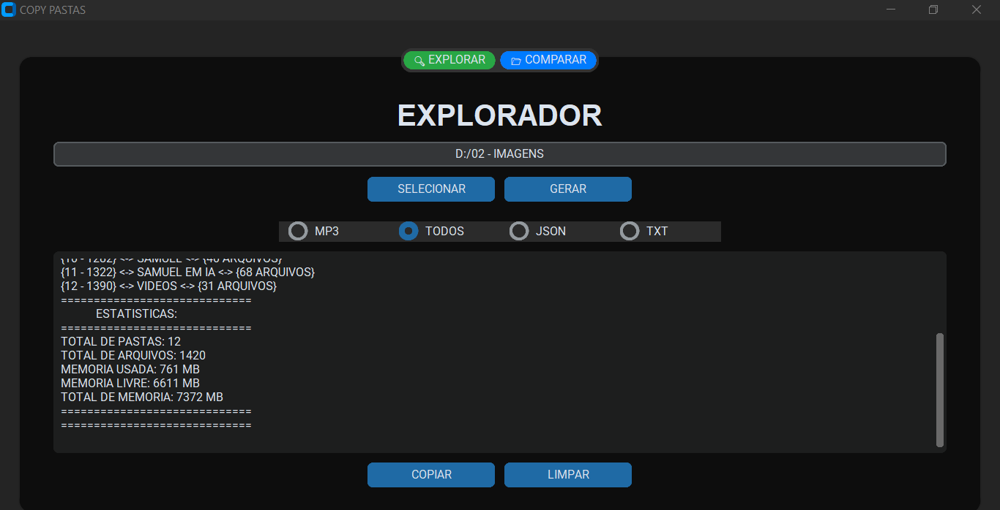
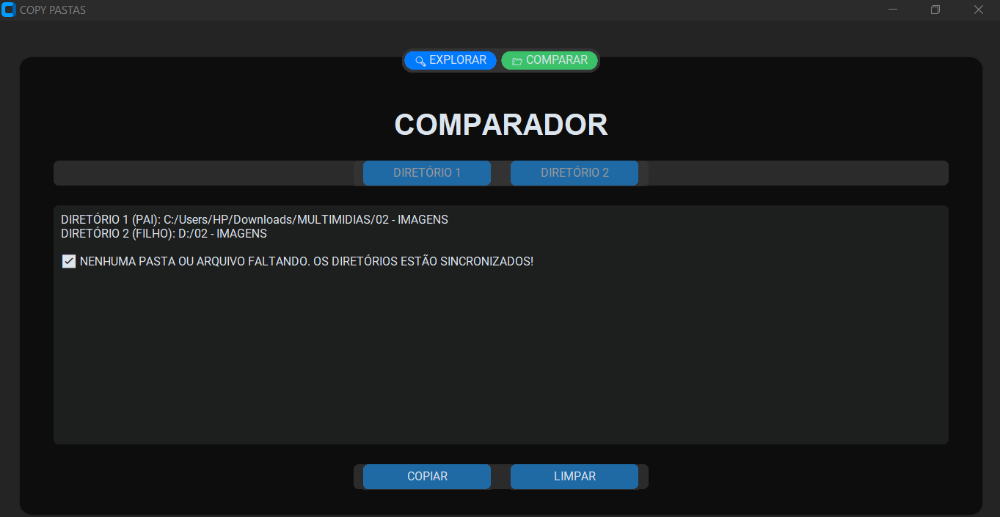

# COPY PASTAS
👨‍🏫COPIE O NOME DE TODOS OS ARQUIVOS, DIRETÓRIOS E SUBDIRETÓRIOS E/OU SELECIONE DUAS PASTAS E VERIFICAR SE TODAS AS SUBPASTAS DO DIRETÓRIO 1 (PAI) TAMBÉM EXISTEM NO DIRETÓRIO 2 (FILHO).

 <br>
 <br>

## DESCRIÇÃO:
O **COPY PASTAS** é um aplicativo para Windows desenvolvido em Python com `customtkinter`, que combina duas funcionalidades em um único ambiente através de abas: **EXPLORADOR** e **COMPARADOR**.

## FUNCIONALIDADES:
1. **Aba EXPLORADOR (🔍 EXPLORAR):**
   * Permite selecionar qualquer diretório no sistema.
   * Lista arquivos e pastas contidos no diretório selecionado.
   * Oferece filtros por tipo: `MP3`, `TODOS`, `JSON` e `TXT`.
   * Gera listas formatadas de arquivos, incluindo estatísticas de memória usada, memória livre e total, além do total de pastas e arquivos/músicas.
   * Permite copiar o conteúdo gerado para a área de transferência e limpar o campo de exibição.
   * Interface intuitiva com botões de seleção, geração e cópia, além de notificações visuais (“toasts”) ao copiar o texto.

2. **Aba COMPARADOR (📂 COMPARAR):**
   * Permite comparar dois diretórios, chamados de “DIRETÓRIO 1 (PAI)” e “DIRETÓRIO 2 (FILHO)”.
   * Lista pastas e arquivos que existem no diretório pai, mas estão ausentes no diretório filho.
   * Identifica subpastas e arquivos faltantes, mostrando-os de forma organizada na tela.
   * Indica quando os diretórios estão completamente sincronizados.
   * Permite copiar ou limpar os resultados da comparação de forma rápida.

## RECURSOS EXTRAS:
* Interface moderna com abas coloridas e arredondadas, usando tons escuros e botões destacados em verde e azul.
* Sistema de “toasts” para alertas visuais quando uma ação é realizada, como copiar para a área de transferência.
* Suporte a pastas ocultas e arquivos de sistema, ignorando-os na listagem e comparação.
* Estatísticas detalhadas sobre memória e quantidade de arquivos, facilitando o gerenciamento de grandes diretórios.

## ÍNDICE NUMÉRICO NO **MP3** E **TODOS**:
### CONCEITO:
É um **conjunto de números de referência** que serve para **identificar e organizar as pastas e as faixas** na ordem em que aparecem no resultado.

Ele **não é nome de pasta**, nem **quantidade de arquivos**.
É apenas um **identificador visual e sequencial**.

### EXEMPLO:
#### RESULTADO:
```
{01 - 01} <-> Rock/Album1 <-> {10 MUSICAS}
{02 - 11} <-> Rock/Album2 <-> {08 MUSICAS}
{03 - 19} <-> Pop/Album1  <-> {12 MUSICAS}
```

#### SIGNIFICADO:
* **01, 02, 03** → índice numérico da pasta
  👉 indica **a posição da pasta na lista**

* A primeira pasta é **01**

* A segunda pasta é **02**

* A terceira pasta é **03**

* **01, 11, 19** → índice numérico da faixa inicial
  👉 indica **em qual número de faixa aquela pasta começa**

* A primeira pasta começa na faixa **01**

* A segunda pasta começa na faixa **11** (a anterior tem 10 músicas)

* A terceira pasta começa na faixa **19** (10 + 8 músicas)

## POR QUE CRIEI ESTE APP?
* **EXPLORADOR:** Após usar o [DRIVESORT](https://www.anerty.net/software/file/DriveSort/) para manter a ordem dos diretórios e subdiretórios do meu PC em sistemas embarcados, percebi a necessidade de criar um novo aplicativo que armazenasse e listasse os nomes desses diretórios em ordem. Eu utilizo meus pendrives em diversos sistemas embarcados, como caixas de som e DVDs, que geralmente não têm tela, apenas saídas de áudio. Isso tornava cansativo ter que adivinhar ou memorizar o número dos diretórios/faixas de cada álbum.

* **COMPARADOR:** O principal motivo foi garantir que todos os diretórios e arquivos presentes no meu **Desktop** estivessem devidamente **sincronizados com meus pendrives**. Com ele, consigo identificar rapidamente se há algo faltando — seja uma pasta inteira ou apenas um arquivo — e até mesmo detectar **nomes divergentes** entre os diretórios. Ele já me **salvou de inúmeros problemas com backups**, evitando perda de dados importantes por falta de organização ou cópias incompletas.

## EXECUTANDO O PROJETO:
1. **Instale as bibliotecas necessárias:** Antes de executar o app, certifique-se de instalar todas as dependências necessárias. No terminal, execute o seguinte comando para instalar as dependências listadas no arquivo requirements.txt em `CODIGO`:
   ```bash
   pip install -r requirements.txt
   ```
   
2. **Inicie o Aplicativo**:
   * Para executar o script Python, navegue até o diretório `./CODIGO` e use o comando:

   ```bash
   python CODIGO.py
   ```

3. **EXPLORADOR:**
   * Abra a aba “🔍 EXPLORAR”.
   * Clique em **SELECIONAR** e escolha um diretório.
   * Escolha o tipo de arquivos que deseja listar (`MP3`, `TODOS`, `JSON` ou `TXT`).
   * Clique em **GERAR** para visualizar a lista.
   * Copie ou limpe o conteúdo usando os botões correspondentes.

4. **COMPARADOR:**
   * Abra a aba “📂 COMPARAR”.
   * Selecione o **DIRETÓRIO 1 (PAI)** e em seguida o **DIRETÓRIO 2 (FILHO)**.
   * O aplicativo mostrará automaticamente os arquivos e pastas ausentes no diretório filho.
   * Copie ou limpe os resultados conforme necessário.

## SOBRE O EXECUTAVEL E O INSTALADOR:
### 1. EXECUTANDO O INSTALADOR:
   * O instalador está localizado no diretório `./APP` e está disponível apenas para sistemas **Windows x64**. Para realizar a instalação, basta **dar dois cliques no arquivo** e seguir as instruções exibidas na tela.

### 2. GERANDO O EXECUTAVEL:
> **IMPORTANTE:** Antes de criar o instalador, é necessário gerar o arquivo `COPY PASTAS.exe`. Para isso, siga os passos abaixo:

   **1. Instalação do PyInstaller:**
   * Certifique-se de ter o PyInstaller instalado. Se não tiver, instale usando o comando abaixo:
   ```bash
   pip install pyinstaller
   ```

   **2. Gerando o Executável:**
   * No diretório `./CODIGO`, utilize o comando abaixo para gerar o executável:

   ```bash
   pyinstaller EXECUTAVEL.spec
   ```

   * O executável `COPY PASTAS.exe` será criado na pasta `./CODIGO/dist`.
   * Após a geração, você pode excluir a pasta `./CODIGO/build`.

### 3. GERANDO O INSTALADOR:
#### PASSO 1: BAIXAR E INSTALAR O INNO SETUP:
1. **Download**: Baixe o Inno Setup do site oficial: [Inno Setup](http://www.jrsoftware.org/isdl.php).
2. **Instalação**: Siga o assistente de instalação para instalar o Inno Setup no seu sistema.

#### PASSO 2: CRIAR O INSTALADOR:
> **IMPORTANTE:** Antes de criar o novo instalador, certifique-se de excluir o arquivo `./APP/COPY PASTAS.exe`.

1. **Editar o arquivo do instalador:**
   * No diretório `./CODIGO`, abra o arquivo `INSTALADOR.iss` e atualize o seguinte trecho:

   * Localize a diretiva `#define Diretorio` e substitua pelo caminho correto do diretório do projeto. Exemplo:

   ```ini
   #define Diretorio "C:\Users\HP\Downloads\GITHUB\REPOSITORIO\02-PROJETOS PUBLICOS\02-APLICATIVOS\COPY PASTAS\CODIGO"
   ```

2. **Gerar o instalador no Inno Setup:**
   * Abra o arquivo `./CODIGO/INSTALADOR.iss` com o **Inno Setup**.
   * Clique em **"Compile"** para gerar o instalador.

3. **Limpar arquivos temporários:**
   * Após a criação do instalador, você pode excluir o executável temporário `./CODIGO/dist/COPY PASTAS.exe`.

4. **Instalando o Aplicativo:**
   * Se o `Aplicativo` não iniciar automaticamente a instalação, você pode executar manualmente o arquivo `./APP/COPY PASTAS.exe` clicando duas vezes sobre ele.
   * O assistente de instalação será iniciado e, por padrão, o aplicativo será instalado no seguinte caminho: `C:\Program Files\COPY PASTAS`.

## NÃO SABE?
- Entendemos que para manipular arquivos em muitas linguagens e tecnologias, é necessário possuir conhecimento nessas áreas. Para auxiliar nesse aprendizado, oferecemos cursos gratuitos e alguns subsídios:
* [CURSO DE PYTHON](https://github.com/VILHALVA/CURSO-DE-PYTHON)
* [CURSO DE CUSTOMTKINTER](https://github.com/VILHALVA/CURSO-DE-CUSTOMTKINTER)
* [CURSO DE AUTOMACAO](https://github.com/VILHALVA/CURSO-DE-AUTOMACAO)
* [CONFIRA MAIS CURSOS](https://github.com/VILHALVA?tab=repositories&q=+topic:CURSO)
* [DOCUMENTAÇÃO OFICIAL DO PYINSTALLER](https://pyinstaller.org/en/stable/)
* [DOCUMENTAÇÃO OFICIAL DO INNO SETUP](http://www.jrsoftware.org/isinfo.php)

## CREDITOS E MAIS:
- [PROJETO CRIADO PELO VILHALVA](https://github.com/VILHALVA)
- [CLIQUE AQUI PARA VER O HISTÓRICO DE ATUALIZAÇÕES](./UPDATES.md)


